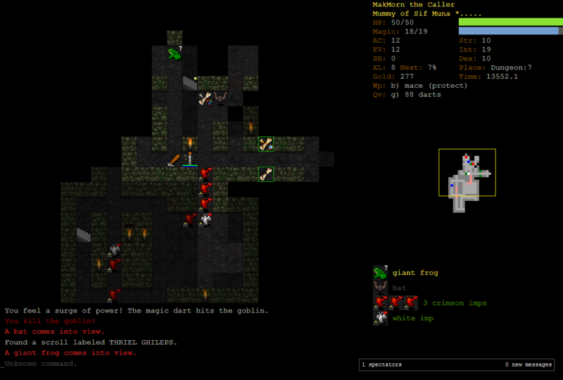

# Rich Adventure
Text based Dungeon Crawler written in Python with the awesome Rich library

## How to run this

Make sure that you have the Rich Library installed
```
pip install rich
```
After you have installed the library you can simply run the game with

```python
python main.py
```

## Idea / Concept
This game is a *dungeon crawler* at it's heart. The user must navigate through a maze while defeating various monsters and collecting items (in order to protect himself.). By defeating monsters the player gains experience and levels up. The aim of this game is to get to the exit while preveiling over the monsters. Of course there are already fantastic dungeon crawler games available. The screenshot below is just an inspiration for us to aim for:



The original screenshot can be found [here](https://de.m.wikipedia.org/wiki/Datei:Dungeon_Crawl_Stone_Soup_-_Musu.png) . We claim no credit or anything for this screenshot it only solves as an inspiration for us.

## Commands
The user can issue the following commands


| Command  |Description                   |
|----------|:-------------:               |
| a	   | The player moves to the left |
| d   | The player moves to the right|
| w       | The player moves up          |
| s     | The player moves down        |
| a        | The player attacks           |
| p        | The player picks up and item etc. |
| h        | Shows help                   |
| i        | Opens the inventory in order to equip weapons etc. |


## Monsters
TODO

## Features
- [ ] Player can enter a unique name
- [ ] Player can select to Start the game or view the highscore
- [ ] Player can level up and grow stronger
- [ ] Player can move around
- [ ] Player can attack
- [ ] Player can pick up and use items (swords etc.)
- [ ] The completed dungeons and player information are saved into a file in order to display a highscore table

## Optional
- [ ] Randomly generated dungeons
- [ ] Randomly placed items and monsters
- [ ] Save and load game states
